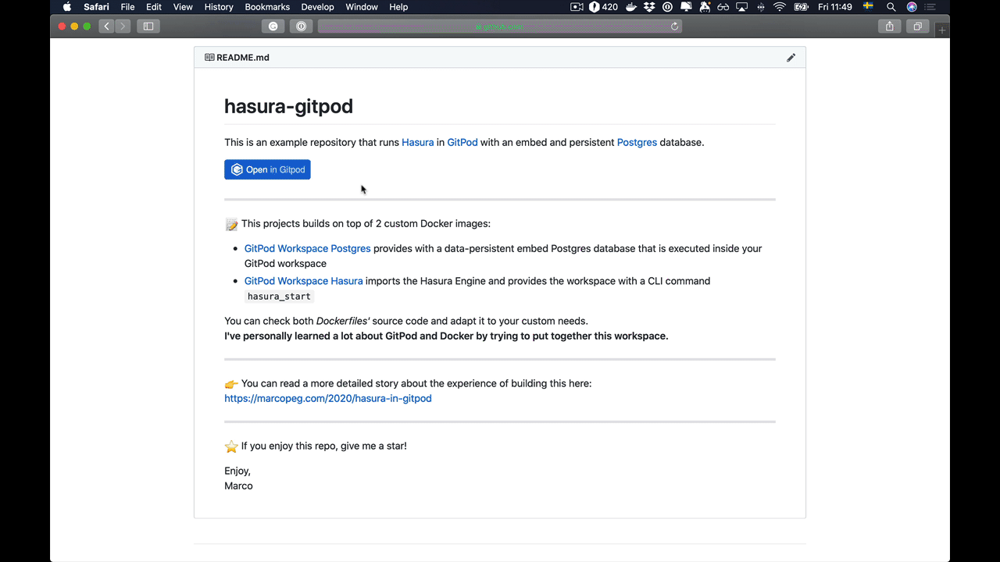

# hasura-gitpod

This is an example repository that runs [Hasura](https://hasura.io/) in [GitPod](https://gitpod.io/)
with an embed and persistent [Postgres](https://www.postgresql.org/) database.

---

📝 This projects builds on top of 2 custom Docker images:

- [GitPod Workspace Postgres](https://github.com/marcopeg/docker-images/tree/master/gitpod-workspace-postgres) provides with a data-persistent embed Postgres database that is executed inside your GitPod workspace
- [GitPod Workspace Hasura](https://github.com/marcopeg/docker-images/tree/master/gitpod-workspace-hasura) imports the Hasura Engine and provides the workspace with a CLI command `hasura_start`

You can check both _Dockerfiles'_ source code and adapt it to your custom needs.  
**I've personally learned a lot about GitPod and Docker by trying to put together this workspace.**

---

👉 You can read a more detailed story about the experience of building this here:  
https://marcopeg.com/2020/hasura-in-gitpod

---

⭐️ If you enjoy this repo, give me a star!

Enjoy,  
Marco
